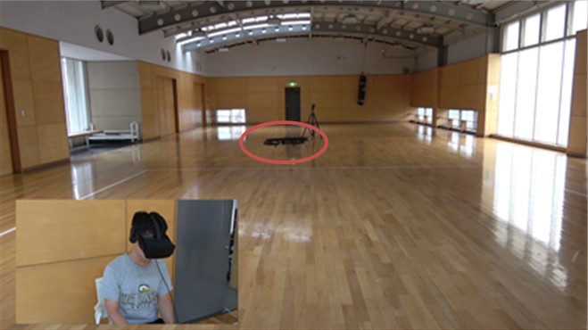
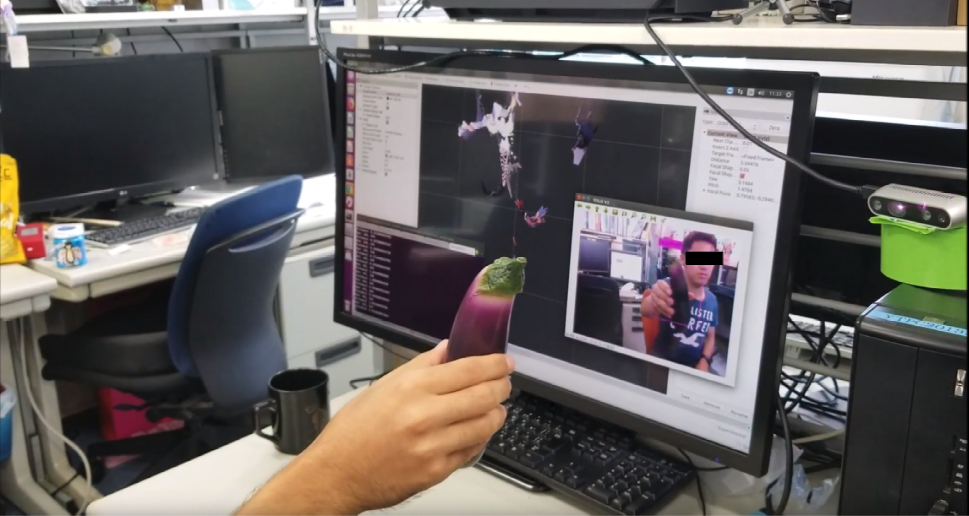
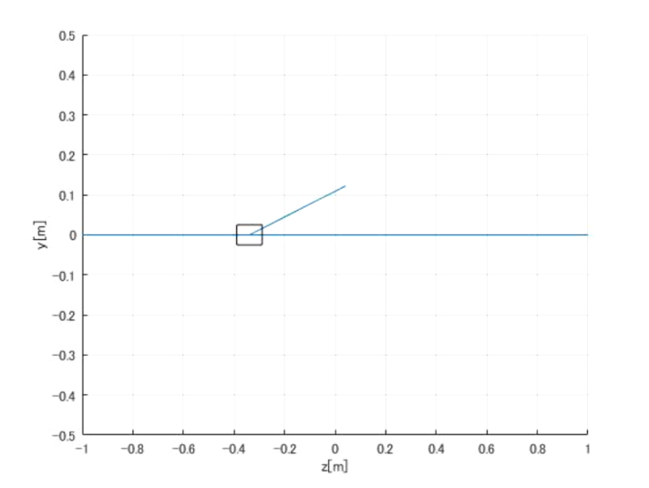

## [Action acquisition using Bayesian optimization](../_research/bopt_dmp.md)

Make the robot learn a motion in small number of iterations (30 iterations)

## [Suppression of Virtual Reality Sickness on Drone](../_research/vrsickness.md)
**[Head-synced Drone Control for Reducing Virtual Reality Sickness](https://link.springer.com/article/10.1007/s10846-019-01054-6)**
***Kandai Watanabe***, [Masaki Takahashi](http://www.yt.sd.keio.ac.jp), Journal of Intelligent & Robotic Systems (2019): 1-12.

Developed a drone controller that aims to suppress the movement that may induce the virtual reality sickness.

## [Image Recognition of an Eggplant for Manipulation Task](../_research/eggplant_yolov3.md)

Implemented a convolutional neural network to detect an eggplant.
Implemented on ROS. It can detect an object, get the depth information and the likelihood of the object.

## [Simulation of Inverted Pendulum using a simple Neural Network](../_research/sim_pendulum.md)
**[YouTube Link](https://www.youtube.com/watch?v=r7sOc22s1KA)**

The neural network was used to decide on when to transition from the unstabilized controller to the stabilized controller.
