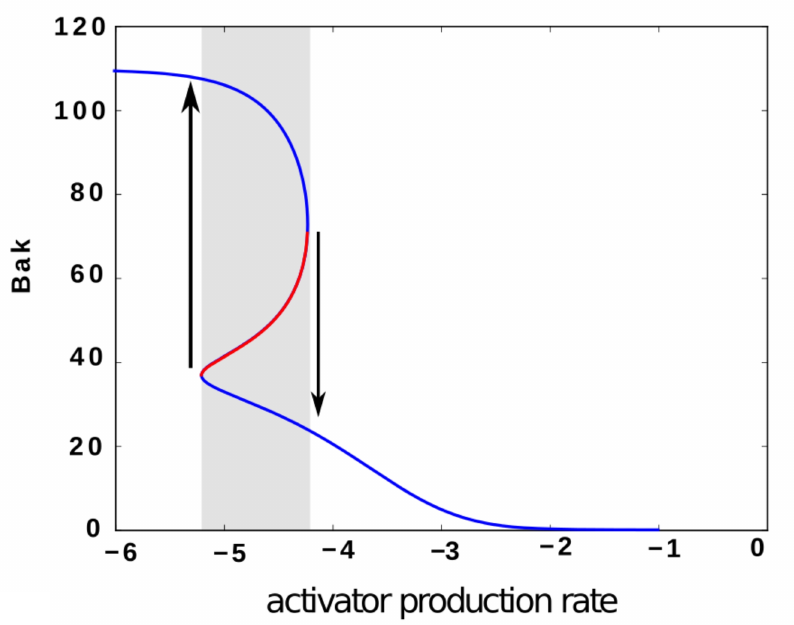

Computational neuroscience is unique among areas of theoretical and quantitative biology for its emphasis on *representation* and *information processing* -- more than any other organ, the brain *computes*.

Representations are apparent in sensory systems, where neural responses can be interpretted as encoding information about features of a visual scene, for example. Notions of representation in the motor system are less clear, and it remains an open question whether primary motor cortex is best thought of as encoding information about limb kinetics, kinematics, some other variables altogether, or perhaps that . Yet these issues of representation carry weight in the design of brain-computer interfaces (BCIs), where the successful implementation of any significantly powerful BCI will likely rely on being able to properly *interpret the neural code*.

## Ongoing projects

### Neuron and behavior tracking in a model cnidarian -- Hydra

### Concurrent-use BCIs

## Previous projects

### Cholinergic retinal waves as traveling pulses in an excitable medium

Frames from simulation of retinal waves model. Top frames show a spreading wave of depolarizing amacrine cells modulated by a slow refractory field (middle frames) and an extra-cellular acetylcholine concentration (bottom frames).
In collaboration with Prof. Nathan Kutz and Dr. Kevin Ford, we developed a reaction-diffusion model of correlated spontaneous activity in the developing retina — activity known as retinal waves. Here, the developing retina was modeled as an excitable medium, allowing for the existence of retinal waves to be predicted above an excitability threshold that is determined from the model’s analysis. The approach is novel in its ability to determine such a criterion in a semi-analytic fashion. This was achieved by separating the dynamics into fast and slow timescales and using numerical continuation software to determine the existence of a traveling wave front for some combinations of the model’s parameters. Above you’ll find a numerical simulation of the model.

* Read more: PLoS Comp Bio Dec 2014

### On bistability as a control mechanism of intrinsic apoptosis

Proposed control mechanism of Bcl-2 regulated apoptosis is through bistable dynamics shown here. Inert Bak is (in)activated in a discontinuous fashion, providing a robust switch.

Intrinsic apoptosis (programmed cell death) is regulated by the Bcl-2 family of proteins, whose interactions on the mitochondrial membrane, on receiving sufficiently strong pro-apoptotic signals, can initiate caspase activation — a point of no return for the cell. Determining how this regulation is implemented, and how it can malfunction, is important for the development of anti-cancer therapies. With Prof.s Terry Speed, Kerry Landman and Ruth Kluck, we developed a kinetic mass-action model of Bcl-2 interactions relevant to a simplified mitochondrial assay containing only a subset of Bcl-2 members. A proposed theoretical control mechanism through which the Bcl-2 family may regulate apoptosis is a bistable switch. By careful calibration of our model with known and estimated kinetic reaction rates we show that bistability is unlikely to play a role in the reduced assay.

* Read more: BMES poster Sept 2013

### Integrating genomic tiling array data into gene prediction with generalized hidden Markov models

Incorporating mRNA expression data (center) with genomic DNA signals to predict coding and non-coding eukaryotic gene structures (top).
My first research project, with Tony Papenfuss, was in computational gene prediction, in which our goal was to build a generalised hidden Markov model to locate genes in eukaryotic DNA using both the sequence content and evidence from genomic tiling arrays. We showed that the incorporation of tiling array data was able to improve the performance of the gene predictor, but not to a degree to make the resulting predictor competitive with then current state of the art predictors.

* Read more: my honours thesis
