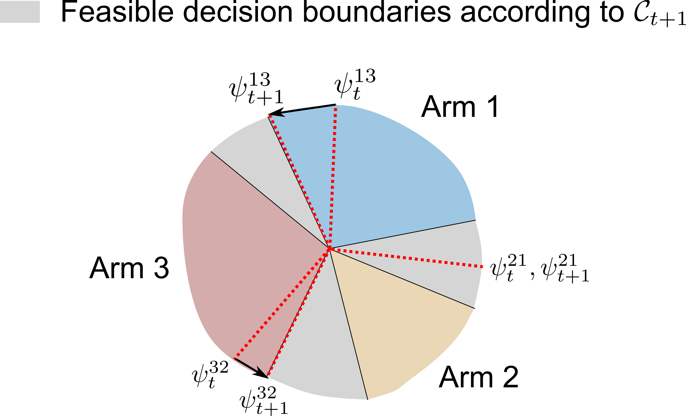
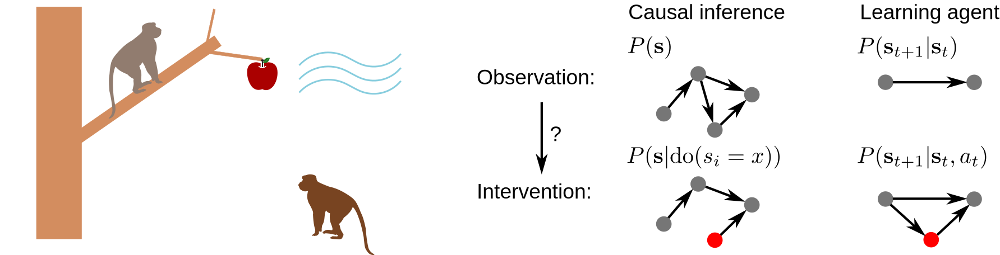
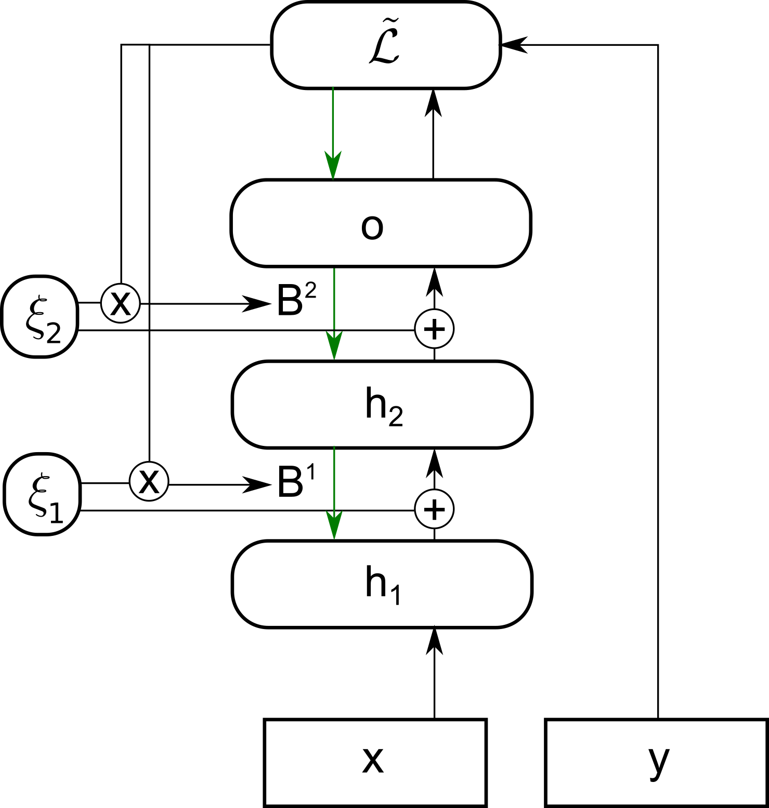
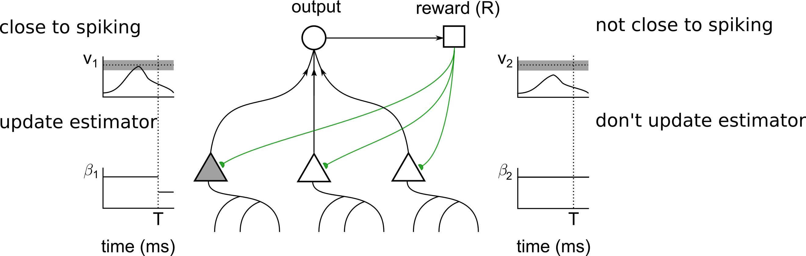
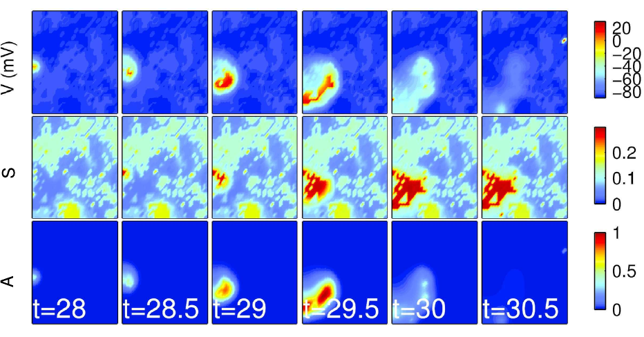
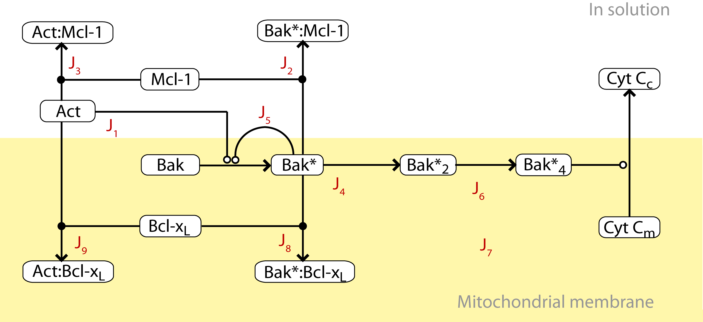
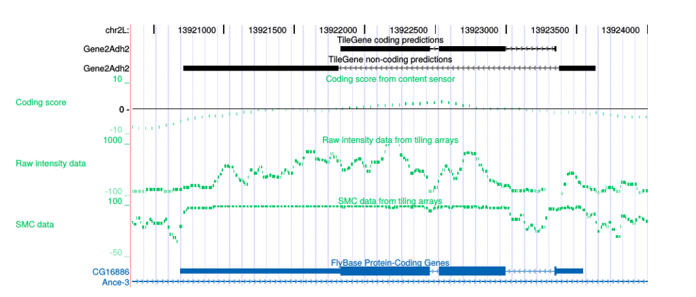

Machine learning (ML), particularly deep learning, has made significant advances in the past decades. However, there are many issues remaining before ML models can be safely, fairly and efficiently implemented in real-world applications. Many of these shortcomings are related to causation: in order to be safe, a model must make policies based on knowing what will happen when a given action is taken; in order to be fair, a model must not rely on spurious correlations to make predictions; and in order to be efficient, a model must learn relationships that are transferable from its training data to new tasks. By studying learning algorithms that address these issues we may also gain insight and inspiration for models of how we ourselves learn.

I am an **applied mathematician** with an interest in **theoretical neuroscience** and **machine learning**. I use insights from **causal inference** to provide better tools and models in both of these areas. This involves building models of how we may do causal learning, and combining methods from causal inference with machine learning to provide more efficient learning algorithms. I believe that this work, in combination with developments in deep learning, will lead to more human-like learning systems. Thus my work involves a combination of statistics, computational modelling, systems neuroscience and tools from deep learning.

Some examples of current and past projects I've worked on are below.

## Machine learning

### Learning optimal policies, while avoiding unnecessary changes in policy

**Lansdell B**, Triantafillou S, Kording K, [arXiv](https://arxiv.org/abs/1905.13121) 2019

*Abstract:* Excessively changing policies in many real world scenarios is difficult, unethical, or expensive. After all, doctor guidelines, tax codes, and price lists can only be reprinted so often. We may thus want to only change a policy when it is probable that the change is beneficial. In cases that a policy is a threshold on contextual variables we can estimate causal effects for populations lying at the threshold. This allows for a schedule of incremental policy updates that let us optimize a policy while making few detrimental changes. Using this idea, and the theory of linear contextual bandits, we present a conservative policy updating procedure which updates a deterministic policy only when justified. We provide simulations and an analysis of an infant health well-being causal inference dataset, showing the algorithm efficiently learns a good policy with few changes. Our approach allows efficiently solving problems where excessive changes are to be avoided, with applications in medicine, economics and beyond.

### Towards intervention-centric causal reasoning in learning agents

**Lansdell B** ([pdf]({{site.baseurl}}/docs/Towards_intervention_centric_causal_reasoning_in_learning_agents__long_.pdf)) ICLR 2020 Workshop on Causal Learning for Decision Making

*Abstract:* Interventions are central to causal learning and reasoning. Yet ultimately an intervention is an abstraction: an agent embedded in a physical environment (perhaps modeled as a Markov decision process) does not typically come equipped with the notion of an intervention -- its action space is typically ego-centric, without actions of the form 'intervene on X'. Such a correspondence between ego-centric actions and interventions would be challenging to hard-code. It would instead be better if an agent learnt which sequence of actions allow it to make targeted manipulations of the environment, and learnt corresponding representations that permitted learning from observation. Here we show how a meta-learning approach can be used to perform causal learning in this challenging setting, where the action-space is not a set of interventions and the observation space is a high-dimensional space with a latent causal structure. A meta-reinforcement learning algorithm is used to learn relationships that transfer on observational causal learning tasks. This work shows how advances in deep reinforcement learning and meta-learning can provide intervention-centric causal learning in high-dimensional environments with a latent causal structure.

### Learning a feedback network through perturbations

**Lansdell B**, Prakash P, Kording K, [arXiv](https://arxiv.org/abs/1906.00889) *ICLR 2020 main meeting*

*Abstract:* Backpropagation is driving today's artificial neural networks (ANNs). However, despite extensive research, it remains unclear if the brain implements this algorithm. Among neuroscientists, reinforcement learning (RL) algorithms are often seen as a realistic alternative: neurons can randomly introduce change, and use unspecific feedback signals to observe their effect on the cost and thus approximate their gradient. However, the convergence rate of such learning scales poorly with the number of involved neurons. Here we propose a hybrid learning approach. Each neuron uses an RL-type strategy to learn how to approximate the gradients that backpropagation would provide. We provide proof that our approach converges to the true gradient for certain classes of networks. In both feedforward and convolutional networks, we empirically show that our approach learns to approximate the gradient, and can match the performance of gradient-based learning. Learning feedback weights provides a biologically plausible mechanism of achieving good performance, without the need for precise, pre-specified learning rules. 

## Theoretical neuroscience

### Neural Spiking for Causal Inference

**Lansdell B**, Kording K, [bioRxiv](https://www.biorxiv.org/content/biorxiv/early/2019/10/15/253351.full.pdf) 2019

*Abstract:* When a neuron is driven beyond its threshold it spikes, and the fact that it does not communicate its continuous membrane potential is usually seen as a computational liability. Here we show that this spiking mechanism allows neurons to produce an unbiased estimate of their causal influence, and a way of approximating gradient descent learning. Importantly, neither activity of upstream neurons, which act as confounders, nor downstream non-linearities bias the results. By introducing a local discontinuity with respect to their input drive, we show how spiking enables neurons to solve causal estimation and learning problems.

### Reconfiguring motor circuits for a joint manual and BCI task

**Lansdell B**, Milovanovic I, Mellema C, Fairhall A, Fetz E, Moritz C *IEEE Transactions in neural systems and rehabilitation engineering 2020* [arXiv](https://arxiv.org/abs/1702.07368)

*Abstract:* Designing brain-computer interfaces (BCIs) that can be used in conjunction with ongoing motor behavior requires an understanding of how neural activity co-opted for brain control interacts with existing neural circuits. For example, BCIs may be used to regain lost motor function after stroke. This requires that neural activity controlling unaffected limbs is dissociated from activity controlling the BCI. In this study we investigated how primary motor cortex accomplishes simultaneous BCI control and motor control in a task that explicitly required both activities to be driven from the same brain region (i.e. a dual-control task). Single-unit activity was recorded from intracortical, multi-electrode arrays while a non-human primate performed this dual-control task. Compared to activity observed during naturalistic motor control, we found that both units used to drive the BCI directly (control units) and units that did not directly control the BCI (non-control units) significantly changed their tuning to wrist torque. Using a measure of effective connectivity, we observed that control units decrease their connectivity. Through an analysis of variance we found that the intrinsic variability of the control units has a significant effect on task proficiency. When this variance is accounted for, motor cortical activity is flexible enough to perform novel BCI tasks that require active decoupling of natural associations to wrist motion. This study provides insight into the neural activity that enables a dual-control brain-computer interface. 

### A reaction-diffusion model of spontaneous neural activity in the developing retina

**Lansdell B**, Ford K, Kutz JN
[PLoS computational biology](https://journals.plos.org/ploscompbiol/article?id=10.1371/journal.pcbi.1003953) 2014

*Abstract:* Prior to receiving visual stimuli, spontaneous, correlated activity in the retina, called retinal waves, drives activity-dependent developmental programs. Early-stage waves mediated by acetylcholine (ACh) manifest as slow, spreading bursts of action potentials. They are believed to be initiated by the spontaneous firing of Starburst Amacrine Cells (SACs), whose dense, recurrent connectivity then propagates this activity laterally. Their inter-wave interval and shifting wave boundaries are the result of the slow after-hyperpolarization of the SACs creating an evolving mosaic of recruitable and refractory cells, which can and cannot participate in waves, respectively. Recent evidence suggests that cholinergic waves may be modulated by the extracellular concentration of ACh. Here, we construct a simplified, biophysically consistent, reaction-diffusion model of cholinergic retinal waves capable of recapitulating wave dynamics observed in mice retina recordings. We are thus able to use non-linear wave theory to connect wave features to underlying physiological parameters, making the model useful in determining appropriate pharmacological manipulations to experimentally produce waves of a prescribed spatiotemporal character.

## Systems Biology

### A computational model of Bcl-2 regulated apoptosis: bistability revisited

**Lansdell B**, Kluck R, Hockings C, Lee E, Fairlie D, Frascoli F, Landman K, Speed T, [BMES 2013](http://benlansdell.github.io/docs/lansdell_BMES.pdf)

*Abstract:* The Bcl-2 family of 15 or more proteins are key regulators of the intrinsic apoptosis pathway. Determining the mechanism two of these proteins (Bak and Bax) use to control mitochondrial outer membrane permeabilisation (MOMP) and subsequent cytochrome c release is therefore the focus of significant research. Here, a deterministic mass-action model of a subset of Bcl-2 family protein interactions is constructed in order to better understand a reduced mitochondrial system in vitro, and its role in apoptosis in vivo. A model which includes direct activation of pro-apoptotic Bak by BH3-only effector proteins is shown to be more consistent with kinetic binding data and Mice Liver Mitochondria (MLM) experiments, compared with a model which does not include direct activation. This represents a novel in vitro model of Bcl-2 mediated apoptosis constrained by experimental and kinetic data. The model does not regulate MOMP through the existence of a bistable switch, as posited by other computational studies. The robustness of the model to parameter variation highlights the different roles pro-survival proteins may play depending on the BH3-only stimulus.

## Bioinformatics

### Compuational gene prediction with genomic tiling microarray data

**Lansdell B**, Speed T, Papenfuss A. Genome Informatics Workshops 2008

*Abstract:* The genome of a higher organism is a complex entity. It is not merely comprised of the genes it encodes, but also of many other contributing elements. Elucidating the function of these elements is a non-trivial task, which lends itself well to computational methods. Here we combine two methods of identifying these functional elements: computational gene prediction and transcription mapping with tiling microarrays. In order to do so a generalised hidden Markov model (GHMM) *ab initio* gene predictor is developed, which is shown to perform comparably to other *ab initio* GHMM predictors. We then incorporate a transcription mapping statistic based on correlations, into a GHMM gene model. This model can predict both protein-coding genes and non protein-coding gene fragments based on tiling array expression data and genomic sequence data, thus accommodating a broader and more realistic view of molecular biology.
